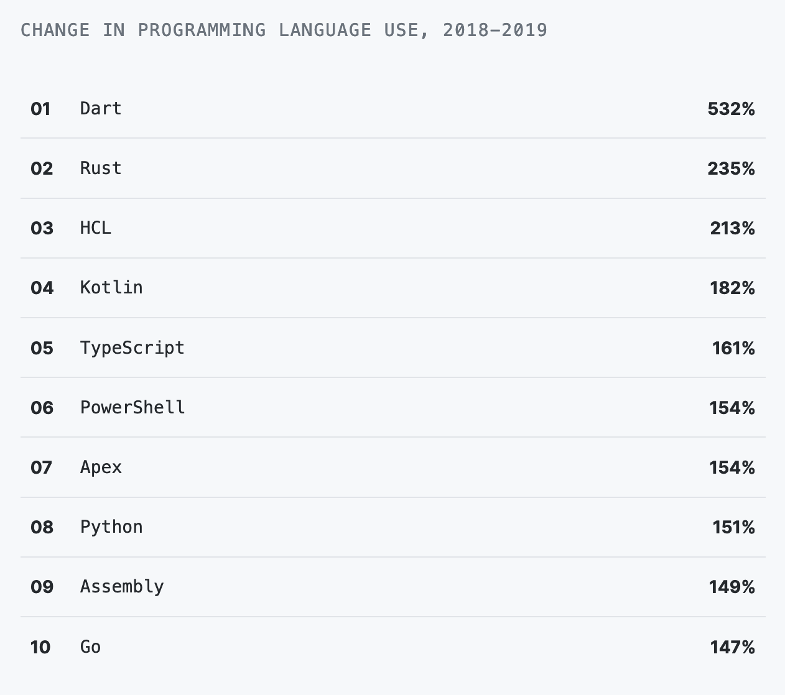
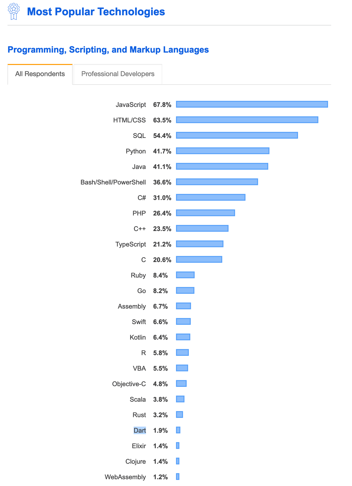
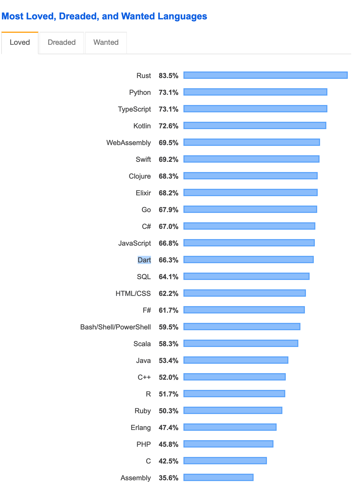
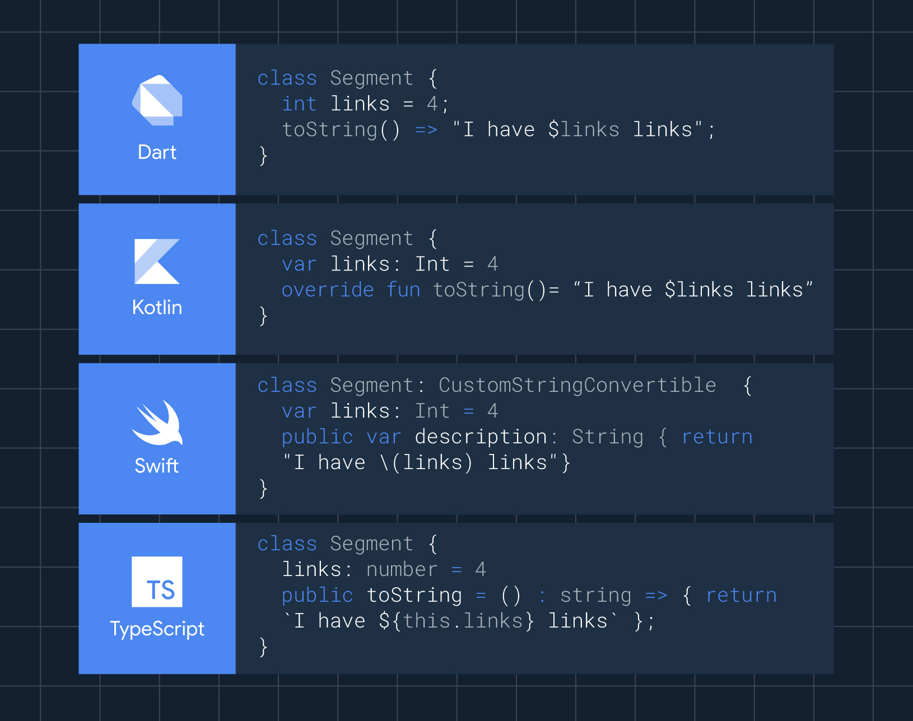

<!-- _class: lead -->


# **Adaptable Apps with Flutter**
##### by
### Brad Cypert

---

# _“What separates design from art is that design is meant to be… functional.”_
#### &nbsp;&nbsp;– Cameron Moll

---
<!-- _class: lead -->
# <!-- fit --> What _is_ Functional Design?

---

# Responsive Design

A design approach that makes content render well on a variety of devices and window or screen sizes from a minimum to a maximum display size. 

---

# Adaptive Design

A design approach that fundamentally changes the way that content is accessed in order to best cater towards the user's expectations of how content on their device should be accessed.

---

# From the Flutter Docs

Adapting an app to run on different device types, such as mobile and desktop, requires dealing with mouse and keyboard input, as well as touch input. It also means there are different expectations about the app’s visual density, how component selection works (cascading menus vs bottom sheets, for example), using platform-specific features (such as top-level windows), and more.

---

# What is Flutter?

Flutter is Google's UI toolkit for building beautiful, natively compiled applications for mobile, web, desktop, and embedded devices from a single codebase.

- Not Responsive
- Not Adaptive
- Provides the tools to make Responsive and Adaptive Apps.
- Powered by Dart

--- 

<!-- _class: lead -->

# What the heck is Dart? 🎯

---



---



--- 



--- 

# Dart's Claim to Fame

### In 2013, Google Announced that the Dart VM would be built into chrome, allowing you to write client-side applications in Dart.

---

# Dart's Claim to Fame

### In 2015, Google killed that chrome feature.

https://techcrunch.com/2015/03/25/google-will-not-integrate-its-dart-programming-language-into-chrome/

---

# What is Dart?

- A "General Purpose" programming language
- Optimized for Client Development.
- Compiles to ARM, x64, JavaScript, Mobile, Web, Desktop
- 🔥 Hot Reloading 🔥
- [Isolate-based concurrency](https://dart.dev/guides/language/language-tour#isolates)
- Sound Null Safety
- Tools for Profiling, Logging, and Debugging

---

# Dart is Familiar



---

```dart
import 'package:cloud_firestore/cloud_firestore.dart';
import 'package:flutter/material.dart';
import 'package:luna_journal/models/pet.dart';
import 'package:luna_journal/repositories/adaptable_repo.dart';
import 'package:luna_journal/repositories/household_repo.dart';
import 'package:provider/provider.dart';

import 'auth_repo.dart';

class PetRepo extends AdaptableRepo<Pet> {

  final collection = FirebaseFirestore.instance.collection("pets");

  final BuildContext context;
  AuthRepo authRepo;
  HouseholdRepo householdRepo;

  PetRepo({this.context}) {
    this.authRepo = Provider.of<AuthRepo>(this.context, listen: false);
    this.householdRepo = Provider.of<HouseholdRepo>(this.context, listen: false);
  }

  Stream<Pet> getById(String id) {
    return collection.doc(id).get().asStream().map((event) => Pet().fromFirebaseSnapshotDocument(event));
  }
}
```

---

