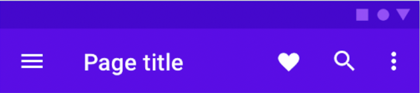

<!-- _class: lead -->


# **Adaptable Apps with Flutter**
##### by
### Brad Cypert

---

# _“What separates design from art is that design is meant to be… functional.”_
#### &nbsp;&nbsp;– Cameron Moll

---
<!-- _class: lead -->
# <!-- fit --> What _is_ Functional Design?

---

# Responsive Design

A design approach that makes content render well on a variety of devices and window or screen sizes from a minimum to a maximum display size. 

---

# Adaptive Design

A design approach that fundamentally changes the way that content is accessed in order to best cater towards the user's expectations of how content on their device should be accessed.

---

# From the Flutter Docs

Adapting an app to run on different device types, such as mobile and desktop, requires dealing with mouse and keyboard input, as well as touch input. It also means there are different expectations about the app’s visual density, how component selection works (cascading menus vs bottom sheets, for example), using platform-specific features (such as top-level windows), and more.

---

# What is Flutter?

Flutter is Google's UI toolkit for building beautiful, natively compiled applications for mobile, web, desktop, and embedded devices from a single codebase.

- Not Responsive
- Not Adaptive
- Provides the tools to make Responsive and Adaptive Apps.
- Powered by Dart

--- 

<!-- _class: lead -->

# What the heck is Dart? 🎯

---

# What is Dart?

- A "General Purpose" programming language
- Optimized for Client Development.
- Compiles to ARM, x64, JavaScript, Mobile, Web, Desktop
- 🔥 Hot Reloading 🔥
- [Isolate-based concurrency](https://dart.dev/guides/language/language-tour#isolates)
- Sound Null Safety
- Tools for Profiling, Logging, and Debugging

---
<!-- _class: lead -->

# Dart is Familiar


---

```dart
import 'package:cloud_firestore/cloud_firestore.dart';
import 'package:flutter/material.dart';
import 'package:luna_journal/models/pet.dart';
import 'package:luna_journal/repositories/adaptable_repo.dart';
import 'package:luna_journal/repositories/household_repo.dart';
import 'package:provider/provider.dart';

import 'auth_repo.dart';

class PetRepo extends AdaptableRepo<Pet> {

  final collection = FirebaseFirestore.instance.collection("pets");

  final BuildContext context;
  AuthRepo authRepo;
  HouseholdRepo householdRepo;

  PetRepo({this.context}) {
    this.authRepo = Provider.of<AuthRepo>(this.context, listen: false);
    this.householdRepo = Provider.of<HouseholdRepo>(this.context, listen: false);
  }

  Stream<Pet> getById(String id) {
    return collection.doc(id).get().asStream().map((event) => Pet().fromFirebaseSnapshotDocument(event));
  }
}
```

---

<!-- _class: lead -->
# Dart's syntax is conducive to building widget (or component) trees


---


---


--- 


--- 
<!-- _class: lead -->

# Dart's Claim to Fame

### In 2013, Google Announced that the Dart VM would be built into chrome, allowing you to write client-side applications in Dart.

---
<!-- _class: lead -->

# Dart's Claim to Fame

### In 2015, Google killed that chrome feature.

https://techcrunch.com/2015/03/25/google-will-not-integrate-its-dart-programming-language-into-chrome/

---
---

```dart
return Container(
  child: Column(
    children: <Widget>[
      StreamBuilder(
        key: ValueKey(true),
        stream: medicationVm.getMedicationsStream(),
        builder: (BuildContext context, AsyncSnapshot<QuerySnapshot> snapshot) {
          if (snapshot.hasError) {
            return new Text('Error: ${snapshot.error}');
          }
          switch (snapshot.connectionState) {
            case ConnectionState.waiting:
              return new Text('Loading...');
            default:
              var entries = snapshot.data.docs
                .map((e) => Medication().fromFirebaseSnapshotDocument(e))
                .toList();

              if (entries.isEmpty) {
                return Padding(
                  padding: const EdgeInsets.fromLTRB(8.0, 16.0, 8.0, 16.0),
                  child: Center(
                    child: Text("No Medications yet! Let's add one with the button below!")
                  ),
                );
              }
              return ListView.builder(
                scrollDirection: Axis.vertical,
                shrinkWrap: true,
                padding: const EdgeInsets.all(8),
                itemCount: entries.length,
                itemBuilder: (BuildContext context, int index) {
                  return MedicationListItem(
                    medication: entries[index],
                    onPressed: () => {
                        Navigator.pushNamed(context, '/medications/${entries[index].documentID}')
                    },
                  );
               });
              }
            },
          ),
        ],
    ));
```

---
<!-- _class: lead -->
# That's a large chunk of Flutter code!

---
<!-- _class: lead -->
# How does Flutter work?

---


---
<!-- _class: lead -->
```dart
void main() async {
    runApp(MyApp());
}
```

---

<!-- _class: lead -->
```dart
class MyApp extends StatelessWidget {

  // This widget is the root of your application.
  @override
  Widget build(BuildContext context) {
    return MultiProvider(
      providers: [
        Provider<Box<String>>(create: (ctx) => Hive.box("cache")),
        ... // DI
      ],
      child: MainAppContent()
    );
  }
}
```
---
<!-- _class: lead -->
```dart
class MainAppContent extends StatelessWidget {
  @override
  Widget build(BuildContext context) {
    
    var themeService = Provider.of<ThemeService>(context);
    
    return MaterialApp(
        title: 'Luna Journal',
        theme: themeService.getThemeData(themeService.activeTheme),
        debugShowCheckedModeBanner: false,
        initialRoute: '/',
        onGenerateRoute: (settings) => router
            .matchRoute(context, settings.name, routeSettings: settings)
            .route
    );
  }
}

```
<!-- _class: lead -->
---
```dart
  @override
  Widget build(BuildContext context) {
    return Scaffold(
        appBar: AppBar(
          title: Text("Medications"),
          actions: [
            if (!editMode)
              Container(
                padding: EdgeInsets.only(right: 8),
                child: IconButton(
                    icon: Icon(FontAwesomeIcons.edit),
                    onPressed: () => {
                          setState(() {
                            editMode = !editMode;
                          })
                        }),
              )
          ],
        ),
        drawer: null,
        body: editMode ? getEditForm() : getViewContainer());
  }
```

---

<!-- _class: lead -->
# So you put some widgets in a tree

---
<!-- _class: lead --->
# Before we go any further.

# I need you know...

---

<!-- _class: lead -->
# I am not a designer.

---
<!-- _class: lead -->

# You get something like this.

## Not too bad for a non-designer.


---
<!-- _class: lead -->

# And that looks bad regardless of whether I'm a designer or not.


---

<!-- _class: lead -->
# So, you open your XCode Project and modify it so that iPad isn't supported.

---

<!-- _class: lead -->
# Except that's not an option!


---

```dart
GridView.count(
    primary: true,
    shrinkWrap: true,
    padding: const EdgeInsets.all(10),
    crossAxisSpacing: 0,
    mainAxisSpacing: 0,
    crossAxisCount: 3,
    children: <Widget>[
        ... // truncated for brevity
    ]),
```

# What a troublemaker!

---

# Introducing the MediaQuery

```dart
MediaQuery.of(context);
```
| Methods | What they return |
|-------- | -------------|
| size    | screen size dimensions |
| devicePixelRatio | number of device pixels per logical pixel |
| orientation | Portrait or Landscape |
| textScaleFactor | number of font pixels for each logical pixel |
| viewInsets | parts of the display that are obscured by system ui like the keyboard  |

---

```dart
crossAxisCount: MediaQuery.of(context).size.width > 900 ? 5 : 3,
```
```dart
GridView.count(
    primary: true,
    shrinkWrap: true,
    padding: const EdgeInsets.all(10),
    crossAxisSpacing: 0,
    mainAxisSpacing: 0,
    crossAxisCount: MediaQuery.of(context).size.width > 900 ? 5 : 3,
    children: <Widget>[
        ... //truncated for brevity
    ]
)
```
## That's _better_, but we can do more than that.


---

```dart
Widget build(BuildContext context) {
    var dialogFactory = DialogFactory(context: context);
    return Container(
      padding: const EdgeInsets.all(4),
      child: Center(
        child: Column(
          mainAxisAlignment: MainAxisAlignment.center,
          children: <Widget>[
            IconButton(
              iconSize: 36,
              icon: Icon(image, 
                color: this.disabled ? Theme.of(context).disabledColor : Theme.of(context).colorScheme.onBackground),
              tooltip: this.tooltip,
              onPressed: this.disabled ? () {
                dialogFactory.createDialog( title: SELECT_PET_TITLE, content: SELECT_PET_CONTENT).show();
              } : this.onPressed,
            ),
            Text(this.text, style: TextStyle(
                fontSize: 16, 
                color: this.disabled ? Theme.of(context).disabledColor : Theme.of(context).colorScheme.onBackground), 
                textAlign: TextAlign.center
            ),
          ],
        )
      ),
    );
```

---

```dart
IconButton(
    iconSize: 36,
    ...
),
```

```dart
IconButton(
    iconSize: MediaQuery.of(context).orientation == Orientation.portrait ?
                (MediaQuery.of(context).size.aspectRatio * 4) * 20 :
                (MediaQuery.of(context).size.aspectRatio * 0.8) * 60,
    ...
),
```

---

## Aspect Ratio Tips

- Phones are slimmer than tablets (creating a more extreme ratio)
- Aspect Ratio changes with Orientation
- Multiply by a "Weight" to help direct how much influence the aspect ratio actually has. (0.5 to 2 is pretty common)

---

```dart
Text(this.text, 
    style: TextStyle(
        fontSize: 16
        ...
        ),
)
```

```dart
var mediaData = MediaQuery.of(context);

Text(this.text, 
    style: TextStyle(
            fontSize: mediaData.textScaleFactor *
            (mediaData.size.aspectRatio.clamp(0.8, 1.2)) *
            16,
            ...
)
```

---


---

# There are other tools like Flex that help with responsive widgets, too.

- ### Flex 💪
- ### Flexible (indicates that children can flex)
- ### Expanded

---
<!-- _class: lead -->
# We've made our app more responsive, but how do we make it _Adaptive_?

---

- ## Tablets, Laptops and Desktops have tighter (closer to 1) aspect ratios than phones
    - ### More space to work with
- ## Watches also have a tigher aspect ratio than phones
    - ### LESS space to work with.

---

- ## Think about how people use the device you're building for.
    - ### Most people would prefer to perform heavy-workloads on a desktop or laptop computer.
    - ### Tablets have become a staple for multi-taskers, artists, and note-takers.
    - ### I hate typing on a phone. Don't make me do it.

---


---


# Why is pet selection hidden behind a dropdown? 

- Its critical enough to keep on the home screen.
- I ran out of space.

---


# On Tablet

- Its critical enough to keep on the home screen.
- I have PLENTY of space.

---

# LayoutBuilder

- A widget
- The "cream of the crop" for adaptive and responsive layouts
- Use for building large layouts
- Use for deciding how small widgets should render
- [Widget of the Week: Layout Builder](https://www.youtube.com/watch?v=IYDVcriKjsw&feature=emb_title)
- [Layout Builder Docs](https://api.flutter.dev/flutter/widgets/LayoutBuilder-class.html)


---
<!-- _class: lead -->

# Master-Detail View

- List on the left, detail on the right


---

```dart
LayoutBuilder(builder: (context, constraints) {
    if (constraints.maxWidth > 900) {
        return Row(
            crossAxisAlignment: CrossAxisAlignment.stretch,
            children: [
                Flexible(
                    flex: 1,
                    child: PetCard(),
                ),
                Flexible(
                    flex: 2,
                    child: getActionGrid(context, petVm, appVm),
                ),
            ]
        );
    } else {
        return Column(
            children: [
                Container(
                    height: 110,
                    child: Center(
                        child: PetCard(),
                    )
                ),
                Flexible(
                    flex: 1,
                    fit: FlexFit.tight,
                    child: getActionGrid(context, petVm, appVm)
                )
            ],
        );
    }
}),
```

---
<!-- _class: lead -->

# Our grid will grow, but we need to make changes to the pet selection, too.

---

- Completely change the way the component is rendered depending on constraints
- use a LayoutBuilder and `constraints.maxHeight > 400`
  - check if the component is being rendered in a box greater than 400 pixels
  - **Phone**: that box is going to be smaller than 400px given the previous layoutbuilder change.
  - **Larger Devices**: will be greater than 400px given the previous change.
- [The code for this is actually kind of big, so here's a link (but we'll show a few pieces in a second)](https://gist.github.com/bradcypert/0911c744d8d55280eaf6a69c67a1bcb3)

---

<!-- _class: lead -->

```dart
if (constraints.maxHeight > 400) {
    return Column(...);
} else {
    return Row(...);
}
```

---


---
<!-- _class: lead -->
# So that's a pretty neat adaptive layout. But is that fully adapative?

---

<!-- _class: lead -->
# What about how data is stored?
## This was a big deal with Luna Journal for multiple reasons.
---

<!-- _class: lead -->
## 1. Cloud Storage (Firebase?)
## 2. Persistent Device Storage (Sqlite, Hive)
## 3. Local Storage (shared prefs, local storage)

---

<!-- _class: lead -->
# Enter the Adapter Pattern!
---

<!-- _class: lead -->

```dart
import 'package:luna_journal/traits/mappable.dart';

abstract class DatabaseAdapter<T extends Mappable> {
  Stream<List<T>> getAll(String ownerId);
  Stream<T> getById(String id);
  Future<T> add(T item);
  Future<void> update(String id, T item);
  Future<void> delete(String id);
}
```

---
<!-- _class: lead -->

```dart
  setAdapterCollection(String collectionName) {
    adapters = {
      DataAdapter.Local: HiveAdapter<T>(collectionName),
      DataAdapter.Cloud: FirebaseAdapter<T>(collectionName)
    };
  }
```

---

```dart
class WeightRepo extends AdaptableRepo<WeightLogItem> {

  static String collectionName = 'weight';
  final BuildContext context;
  AuthRepo authRepo;
  HouseholdRepo householdRepo;

  WeightRepo({this.context}) {
    this.authRepo = Provider.of<AuthRepo>(this.context, listen: false);
    this.householdRepo = Provider.of<HouseholdRepo>(this.context, listen: false);
    this.appSettingsRepo = Provider.of<AppSettingsRepo>(this.context, listen: false);
    setAdapterCollection(collectionName);
  }

  Stream<WeightLogItem> getById(String id) => getAdapter().getById(id);
  Future<WeightLogItem> add(WeightLogItem item) => getAdapter().add(item);
  Future<void> update(String id, WeightLogItem item) => getAdapter().update(id, item);
  Future<void> delete(String id) => getAdapter().delete(id);
  Stream<List<WeightLogItem>> getAsStream(ownerId) => getAdapter().getAll(ownerId);
}
```

---

<!-- _class: lead -->
# Adaptive apps lead to more choice.
---
<!-- _class: lead -->


---

<!-- _class: lead -->
# Okay, that makes sense, but back to the UI. Interface expectations can be so vastly different! 😩

---


---
<!-- _class: lead -->

# Flutter gives you access to both styles and allows you to choose how you want to represent them.

---

## Flutter also adapts some APIs by default: https://flutter.dev/docs/resources/platform-adaptations

- Navigation animations
- How a user can "go back" to a previous view
- scroll physics
- typography (when using flutter/material)
- iconography
- and many more

---





---


# What about Web?
## Is this "App Bar" Enough?


---

# "Phones, Tablets, and Computers usually serve different purposes for different individuals."
## - Brad Cypert

---

<!-- _class: lead -->
# More Adaptive Patterns Beyond The Layout

---

- Keyboard Shortcuts
- Swipe Actions
- Scrollbars
- Integrations with existing APIs
  - Local storage
  - Location APIs
  - Screen Capture
  - Microphone / Camera usage

---
<!-- _class: lead -->

# Flutter gives you the tools to handle these interactions, but have to choose to use them.

---
<!-- _class: lead -->

# That being said, there are a lot of third party packages that provide abstractions over these items.

---
<!-- _class: lead -->

# Think about the platforms that you're building for. Use other apps on those platforms. 

---
<!-- _class: lead -->
# What do they do well? 

---
<!-- _class: lead -->

# What do they do poorly? 
---
<!-- _class: lead -->

# What's common between apps on the same platform? What's intuitive given the platform?

---
<!-- _class: lead -->

# There are tens of thousands of apps that don't "feel" right. Adaptive Apps could be your competitive advantage.

---
<!-- _class: lead -->

# Questions?


---

<!-- _class: lead -->

#  [LunaJournal.app](https://www.LunaJournal.app)
#  [BradCypert.com](https://www.bradcypert.com)
#  [@bradcypert](https://www.twitter.com/bradcypert)
#  [@bradcypert](https://www.github.com/bradcypert)
##  [This Talk (github.com/bradcypert/presentations)](https://github.com/bradcypert/presentations/tree/main/adaptable-apps-with-flutterhttps://www.github.com/bradcypert/presentations/)